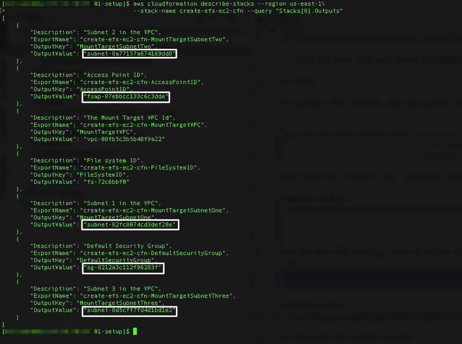

# Pay as you go machine learning inference with AWS Lambda

This repo contains AWS CloudFormation and SAM templates that deploy serverless applications. The applications illustrate how to perform inference with breast cancer XGBoost ML model, and Python packages mounted from EFS.

For full details on how this works:
- Read the Compute Blog post at: https://aws.amazon.com/blogs/compute/pay-as-you-go-machine-learning-inference-with-aws-lambda/

Important: this application uses various AWS services and there are costs associated with these services after the Free Tier usage - please see the [AWS Pricing page](https://aws.amazon.com/pricing/) for details. You are responsible for any AWS costs incurred. No warranty is implied in these examples.

```bash
.
├── README.MD                           <-- This instructions file
├── 01-setup                            <-- Creates VPC, subnets and EFS file system
│   └── create-efs-ec2-cfn.yml          <-- CloudFormation template to creates VPC, subnets, EFS file system and EC2
├── 02-train-code                       <-- Python code used to train breast cancel XGBoost Model
│   └── requirements.txt                <-- Python packages needed for the training and inference
│   └── bc_xgboost_train.py             <-- Python file used to train breast cancel XGBoost Model
├── 03-lambda-template                  <-- XGBoost inference function example to use VPC and EFS
│   └── xgboost_inference_function      <-- Python dependencies and scripts
│   └── template.yaml                   <-- SAM template
├── 04-lambda-test-events               <-- Lambda test events
│   └── test-event-1.json               <-- One sample Lambda test events for Breast Cancer prediction
```


## Requirements

* AWS CLI already configured with Administrator permission
* [Python 3.7.9 installed](https://www.python.org/downloads/release/python-379/)

## Installation Instructions

1. [Create an AWS account](https://portal.aws.amazon.com/gp/aws/developer/registration/index.html) if you do not already have one and login.

1. Clone the repo onto your local development machine using `git clone`.

## Setup
**Note that the CloudFormation stack will create all the resources in us-east-1 (N. Virginia)**. 

To create a VPC, subnets, EFS file system, and EC2 launched in the VPC, use the `create-efs-ec2-cfn.yml` in the `01-setup` directory. 

Replace `ParameterValue` with a Key pair name in your AWS account, in order to enable SSH access to the EC2 created.

To deploy this template, run in a terminal:

```
aws cloudformation create-stack --region us-east-1 \
                                --stack-name create-efs-ec2-cfn \
                                --template-body file://./create-efs-ec2-cfn.yml\
                                --parameters  ParameterKey=KeyName,ParameterValue=my_default_ec2
```
Note that the `template-body` parameter must include the `file://` prefix when run locally.

Expected output:


You can find VPC settings, list of subnet IDs, and list of access point ARNs created previously by the CloudFormation Stack, in the setup phase, by executing the following CLI command:
```
aws cloudformation describe-stacks --region us-east-1\
                                   --stack-name create-efs-ec2-cfn --query "Stacks[0].Outputs"
```
Expected output:


## Deploying the Lambda function

1. From the command line, change directory into the `03-lambda-template` directory, then run:
```
sam build
sam deploy --guided
```
Follow the prompts in the deploy process to set the stack name, AWS Region, security group ID, subnets IDs (comma separated), and Access Point ARN.


## How it works

* The deployed Lambda functions are configured with your VPC and subnet settings.
* The Lambda functions mount the EFS file system you specify. 
* Upon invocation, the Lambda function will load the Python Packages and XGBoost model from EFS to run the code that performs the inference.

## Testing

Now you can test your Lambda with the example test event `test-event-1.json` in the `04-lambda-test-events` directory.   

## Questions?

Please contact [@e_sela](https://twitter.com/e_sela) or raise an issue on this repo.

==============================================

Copyright 2020 Amazon.com, Inc. or its affiliates. All Rights Reserved.

SPDX-License-Identifier: MIT-0